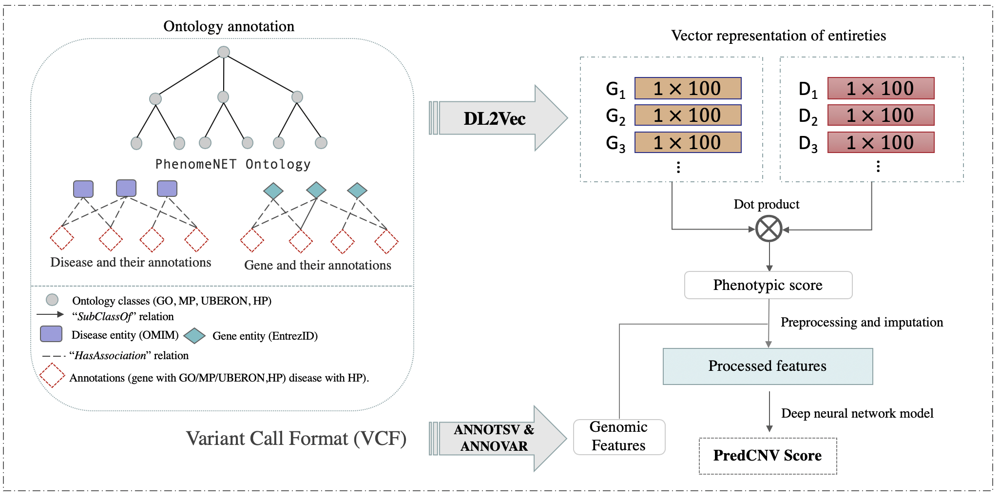

# PhenoCNV - Prioritizing Copy Number Variants (CNV) using Phenotype and Gene Functional Similarity
                                                                  
## Dataset
We train and evaluate our method using human genomic Structural Variation collected from [dbvar](https://ftp.ncbi.nlm.nih.gov/pub/dbVar/data/Homo_sapiens/by_assembly/GRCh38/vcf/) dataset.

## Prediction the candidate CNVs workflow
We integrate the annotates from Gene ontology [GO](http://geneontology.org/docs/download-go-annotations/), Uber-anatomy ontology
 [UBERON](https://www.ebi.ac.uk/ols/ontologies/uberon), Mammalian Phenotype ontology [MP](http://www.informatics.jax.org/vocab/mp_ontology), and Human Phenotype Ontology [HPO](https://hpo.jax.org/app/download/annotation) using [DL2vec](https://github.com/bio-ontology-research-group/DL2Vec). We convert different types of Description Logic axioms into graph representation, and then generate an embedding for each node and edge type.
We collected genomics features using public tool [AnnotSV](https://lbgi.fr/AnnotSV/annotations). 



## Installation 
```
pip install phenocnv
```

## Running the prediction model
1. Download all the files in [data](https://bio2vec.cbrc.kaust.edu.sa/data/azza/data/) and place them into data folder.
2. Download and install the required database [AnnoSV](https://lbgi.fr/AnnotSV/downloads), then run:
    ```
    bash annotation.sh -i input.vcf -o annotated_file
    ```
    and place the annotated VCF file into data folder. 

3. Run the command `phenocnv --help` to display help and parameters:
    ```
    Usage: phenocnv [OPTIONS]

      PredCNV: A phenotype-based tool to prioritize caustive  CNV using WGS data
      and Phenotype/Gene Functional Similarity

    Options:
      -d, --data-root TEXT      Data root folder  [required]
      -i, --in-file TEXT        Annotated Input file  [required]
      -p, --hpo TEXT            List of phenotype ids separated by commas
                            [required]

      -maf, --maf_filter FLOAT  Allele frequency filter using gnomAD and 1000G
                            default<=0.01

      -m, --model_type TEXT     Ontology model, one of the following (go , mp ,
                            hp, cl, uberon, combined), default=mp

      -ag, --aggregation TEXT   Aggregation method for the genes within CNV (max
                            or mean) default=max

      -o, --outfile TEXT        Output result file
      --help                    Show this message and exit.
    ```

### Example:
    phenocnv -d data/ -i example_annotsv.tsv -p HP:0003701,HP:0001324,HP:0010628,HP:0003388,HP:0000774,HP:0002093,HP:0000508,HP:0000218 -m 'go' -maf 0.01 -ag max -o example_output.txt

 ```   
 |========                        | 25% Reading the input phenotypes...
 |================                | 50% Phenotype prediction... 
 |========================        | 75% CNV Prediction... 
 |================================| 100% DONE! You can find the prediction results in the output file: example_output.txt
```
#### Output:
The script will output a ranking a score for the candidate caustive CNV. 


## Scripts
- Details for predicting gene-disease associations with DL2Vec can be found in the [experiment](https://github.com/bio-ontology-research-group/DL2Vec/tree/master/Experiment).
- ``annotations.sh``: This script is used to annotate the varaints.
- ``data_preprocessing.py``: preprocessing the annotations and features.
- ``dl2vec_prediction.py``: script to get the DL2vec score using the trained model.
- ``model_training.py``: script to train and testing the model, with Hyperparameter optimization
- ``BWA_GATK.sh`` : script to run GATK workflow for the input fastq files for the real samples, run using KAUST Supercomputing [IBEX](https://www.hpc.kaust.edu.sa/ibex).
- ``run_Manta.sh`` : script to generate VCF with the structural variants (SVs), we used [Manta](https://github.com/Illumina/manta) to identify the candidate SVs.  run using KAUST Supercomputing [IBEX](https://www.hpc.kaust.edu.sa/ibex).

## Final notes
For any questions or comments please contact: azza.althagafi@kaust.edu.sa
